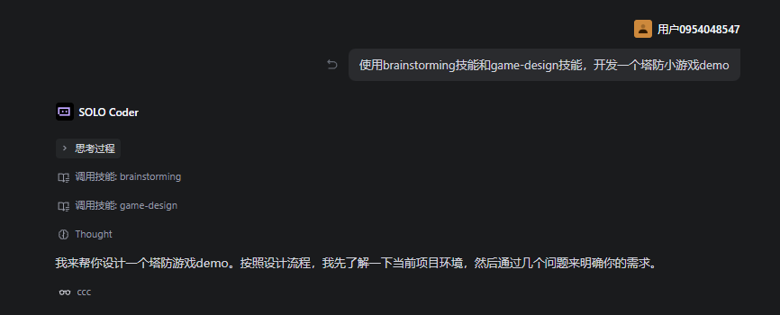

# 开发
直接从superpowers的需求分析（brainstorming技能）以及一个游戏设计(game-design技能）开始。


之后会经历计划编写，开发等过程，中间需要回答一些问题。


# 修复 Bug


建议新开窗口让修复Bug，上下文从0开始。

## 提示词

```
使用systematic-debugging技能，修复balabala
```

## 说明

Superpowers 工作流中的 `systematic-debugging` 会保证 AI：

1. 先读完相关代码
2. 找到根因再修复问题

> 如果直接让 AI 修 bug 而不看完代码，AI 很容易乱改。
