# 环境安装与基本配置

> 环境安装前先说明 PowerShell 的打开方式，后续步骤中会经常使用。
> 点击底部 **开始菜单（Windows 图标）**，键盘搜索 `powershell`，点击打开即可（Win10 同理）。
> 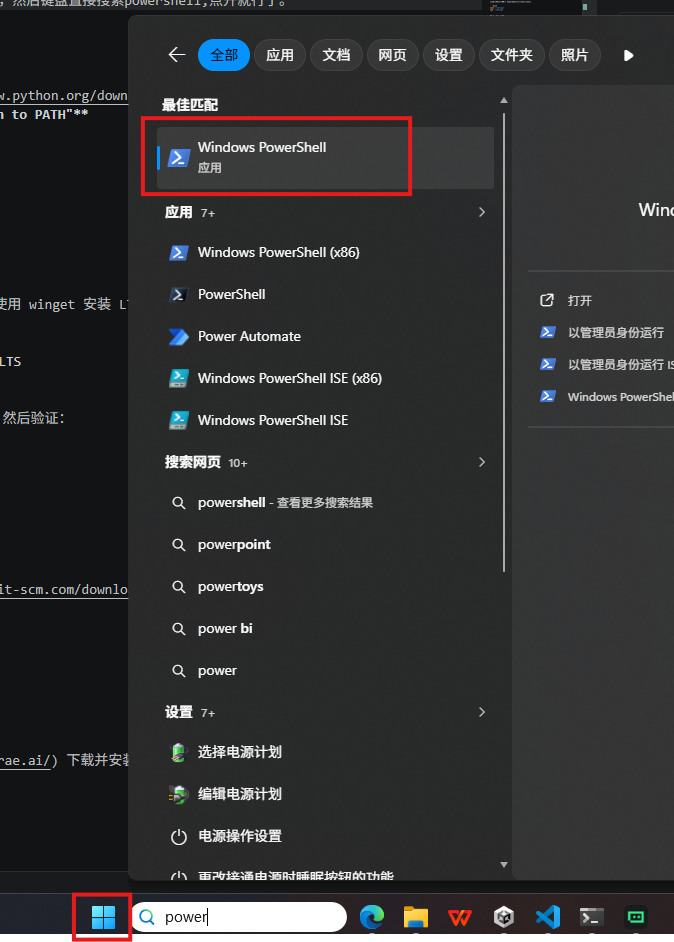

## 1. Python 安装

1. 从 [python.org](https://www.python.org/downloads/) 下载 Python 3.11 以上版本
2. 安装时务必勾选 **”Add Python to PATH”**
3. 验证安装：

```powershell
python --version
pip --version
```

## 2. Node.js 安装

在 PowerShell 中执行以下命令，使用 winget 安装 LTS 版本（v20+）：

```powershell
winget install OpenJS.NodeJS.LTS
```

安装完成后**重启 PowerShell**，然后验证：

```powershell
node --version
npm --version
```

## 3. Git 安装

1. 从 [git-scm.com](https://git-scm.com/downloads) 下载并安装 Git
2. 安装后验证：

```powershell
git --version
```

## 4. Trae IDE 安装

1. 从 [trae.ai](https://www.trae.ai/) 下载并安装 Trae
2. 首次打开后登录账号
3. 在设置中确认 AI 助手功能正常

---

# Playwright MCP 安装（可选）

1. 确保已安装 Node.js（v18+），可从 [nodejs.org](https://nodejs.org/) 下载。

2. 全局安装 Playwright MCP：

```powershell
npm install -g @anthropic/playwright-mcp
npm install -g @playwright/test
```

3. 安装 Chromium：

```powershell
npx playwright install chromium
```

4. 验证安装：

```powershell
npx @anthropic/playwright-mcp --help
```

5. 配置到 Claude Code / Trae：

在 `~/.claude/settings.json` 的 `mcpServers` 中添加：

```json
{
  “mcpServers”: {
    “playwright”: {
      “command”: “npx”,
      “args”: [“@anthropic/playwright-mcp”]
    }
  }
}
```

6. 重启 Claude Code / Trae 使配置生效。

---

# 使用 Phaser + TypeScript + Vite 开发小游戏

## 1. 创建项目

新建一个项目文件夹。

## 2. 复制配置文件

将本项目中的 `TraeConfigs/ProjectConfigs/` 下面的内容复制到项目根路径下，使 Trae 能够加载 AI 行为配置。

## 3. 用 Trae 打开项目

在 Trae 中打开项目文件夹，确认 AI 助手已加载 `AGENTS.md` 中的配置。

**启动 Playwright MCP（可选）**

如果装好了 Playwright MCP，就在这里启动。

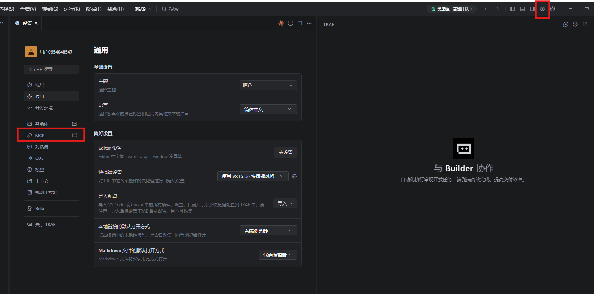
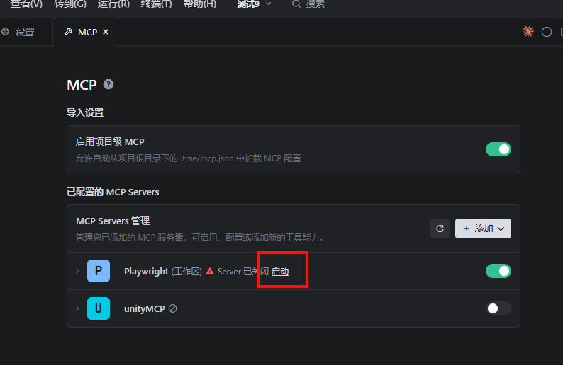

## 4. 提示词示例

> “开发一个塔防小游戏demo”

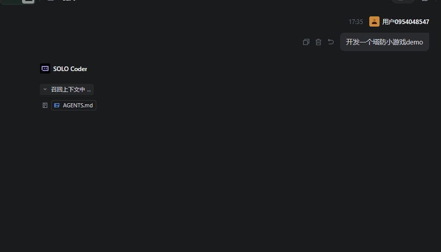

## 5. 启动游戏

直接说”启动并测试游戏”。如果装了 Playwright MCP 它就可以自动测试游戏，没装就不行。另外，测试游戏时会自动截图判断游戏内容，所以这个时候需要用带视觉理解的模型（qwen3.5/3.6, doubao, kimi 等）。

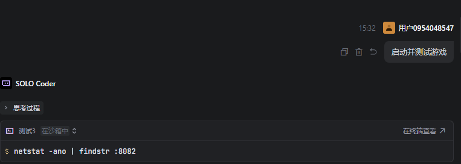

等待启动服务器后：

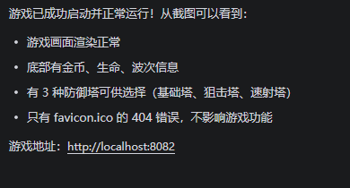

在这里打开 Trae 内置浏览器，然后进入 `localhost:8082` 就可以进入游戏。

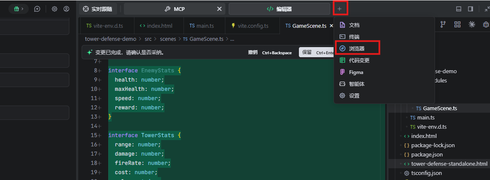

## 6. 可能的错误修复

- **编译错误**

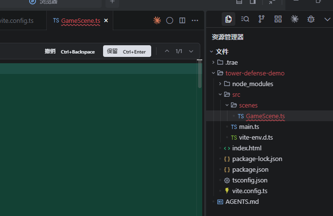

直接用让它修复编译错误即可。

- **浏览器控制台报错**
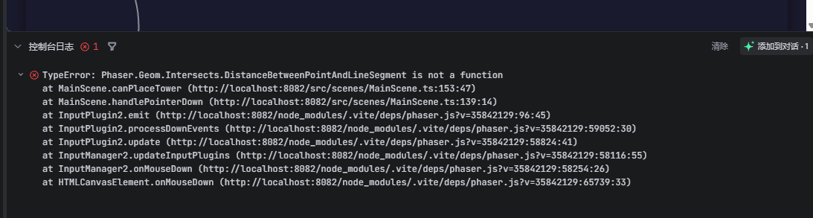
  复制控制台报错信息给它修复。

## 7. 更换美术素材

直接问”怎么换美术素材”

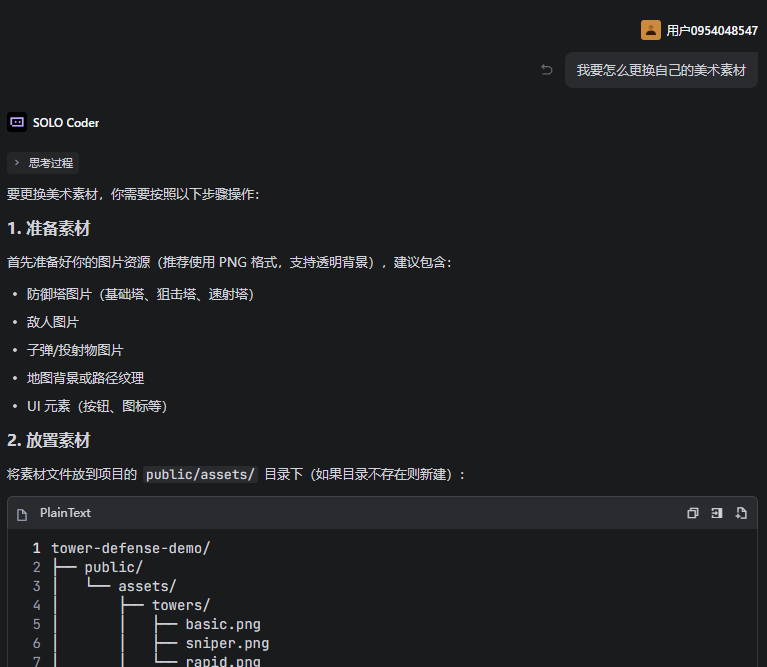

## 8. 生成独立版本

可以直接发给别人试玩、不需要服务器的版本。直接说”生成独立版本”

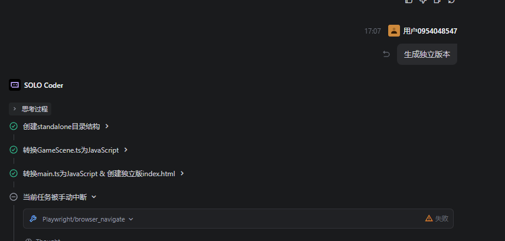

---

P.S. 最新的关于 AI 自动生成小游戏的研究来自香港中文大学：[OpenGame](https://github.com/leigest519/OpenGame)
